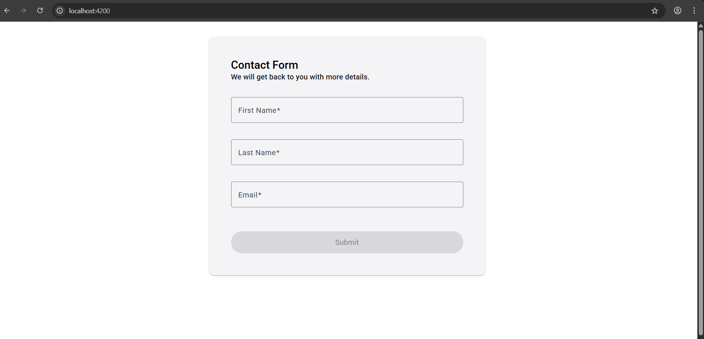

# ContactForm Frontend

This is a lightweight **Angular 19** application that serves as a frontend for submitting contact form data. The form collects a user's **first name**, **last name**, and **email**, then sends a POST request to the backend API upon submission.

The backend service handling the form data can be found here:  
👉 [MonriContactForm-Backend](https://github.com/kanita-sehic/MonriContactForm-Backend)

---

## ✨ Features

- Built with **Angular 19**
- Simple and clean contact form UI
- Form validation (required fields, email format)
- Sends form data to the backend API on submit
- Shows basic success/error messages

---

## 🖥️ Technologies Used

- Angular 19
- TypeScript
- Reactive Forms
- HTTP Client module

---

## 🚀 Getting Started

### 1. Clone the Repository

```bash
git clone https://github.com/your-username/contact-form-frontend.git
cd contact-form-frontend
```

### 2. Install packages
```bash
npm install
```

### 3. Run the application
```bash
npm start
```

### 4. Make sure ContactFormAPI is running


